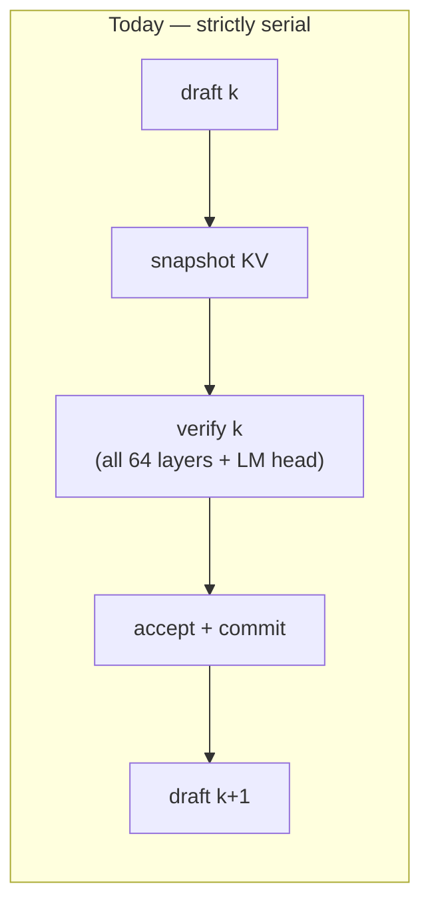
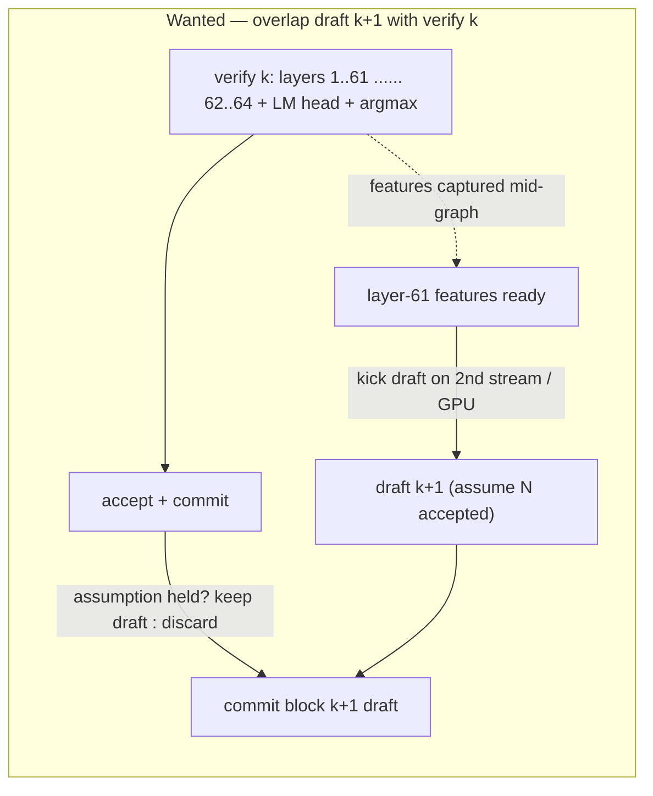

# Speculative-Speculative Decoding (idea note)

**Status:** exploration. One concrete escape hatch (input-unmasking) was tested and
rejected. See [topk-head-optimization.md](./topk-head-optimization.md) for the surrounding
DFlash design.

## The idea

Today the DFlash loop is strictly serial: draft block *k* → snapshot KV → **verify block *k*
(full target forward)** → accept longest prefix → commit → draft block *k+1*. Draft *k+1* only
starts *after verification of *k* is completely finished* (and after accept + commit).

**Speculative-speculative decoding** wants to hide that gap: while the target is busy verifying
block *k*, speculatively start drafting block *k+1* off a **conservatively-assumed accepted
prefix** (e.g. "assume the first N draft tokens will be accepted"). If the assumption holds, the
next block is already drafted the moment verify returns — we've overlapped two serial stages.

Correctness is unconditional: the draft is only ever a *proposer*. Every committed token is still
exactly verified by the target, so a wrong speculative guess is discarded, never committed. The
worst case is a wasted draft, i.e. lower accept rate — **never a lossy output.**

## The catch: the target hidden-state dependency

The draft doesn't run on tokens alone — it cross-attends to **captured intermediate hidden states
of the target** at `capture_layer_ids = {1, 16, 31, 46, 61}` (64-layer target). Those features for
the accepted prefix are produced *by the verify forward itself*. So drafting *k+1* early needs the
target features for *k*'s accepted tokens — which don't exist until verify runs.

The **last** capture (layer 61) is the binding constraint: only ~last 3 layers + the LM head run
after it, so the true overlap window is only ~9% of a verify pass. And crucially, in the current
code nothing surfaces "layer 61 done" to the host — `verify_batch` is one monolithic graph compute
that returns only when *all* layers + LM head + argmax finish.

To actually exploit the window you'd have to **split the target graph at layer 61** (or fire a CUDA
event mid-graph) and launch the draft on a second stream/GPU. None of that exists yet — the
remote-draft IPC path is also request/response, not overlapped.

## What we tried to remove the dependency — and why it failed

Proposed escape hatch: **don't wait for layer-61 features at all.** Re-run the draft for block
*k+1* on the *same* inputs as block *k* (same prefix `target_hidden_cat`), only additionally
**unmasking the first N assumed-accepted draft tokens**. If the block-diffusion backbone conditioned
its tail predictions on revealed prefix tokens, we'd get a refined next block with **zero new target
hidden states** — killing the layer-61 dependency outright.

**Probe (`DFLASH_UNMASK_PROBE=1`, chain calib path).** Per step, re-run the draft three ways and
score tail positions `N+1..15` against the chain-verify target argmax:

- **(a)** all-masked baseline (current behavior)
- **(b)** unmask N *correct* tokens (oracle upper bound)
- **(c)** unmask N *phase-1* tokens (what runtime would actually feed)

Build only if **b > a**.

**Result — decisive NO.** Across 3 GSM prompts (`n_gen=128`), **(b) sat 11–26 pp *below* (a)** at
every N, including at N ≈ mean accept (~6–7). (c) was also far below (a), which rules out a scoring
artifact: interior block positions **only ever saw MASK during training**, so *any* real embedding
there is out-of-distribution and actively corrupts the forward — it isn't merely ignored.

> Reproduce self-check (N=0, identical inputs) had to reproduce phase-1 exactly: it went 0/15 → 15/15
> after fixing a ggml gallocr gotcha (snapshot graph inputs *before* compute; gallocr reuses input
> memory for intermediates).

**Takeaway.** Input-unmasking can't remove the target hidden-state dependency with this backbone.
This matches why DeepSeek's DSpark added a separate **Markov head** for intra-block dependency
instead of unmasking the backbone (`dspark_head.{h,cpp}` already exists in-tree).

## Where this leaves the idea

- The overlap is still real latency to reclaim, but only via **graph-split / event-driven launch**
  gated on the layer-61 features — not via unmasking.
- The **conservative-N estimator** (how many tokens to assume accepted) is the other half and stands
  regardless: chain-survival product (`adaptive_verify_width.h`), or `draft_entropy`.
- Open pivot: does the **Markov/confidence head** recover the tail where unmasking failed (b > a with
  the head)? Untested.
